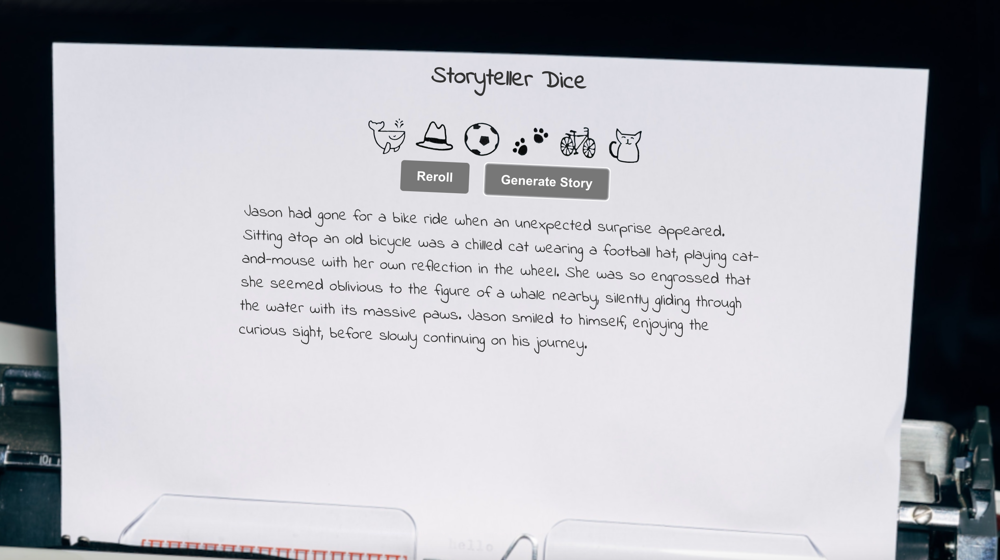

# Storyteller Dice

Storyteller Dice is a frontend web application that combines the element of chance with AI language generation. It generates a set of six images from a pool of thirty-six options and uses the GPT3.5 API to craft unique stories based on the selected images.

## Installation

To install the application, follow these steps:

1. Clone the repository to your local machine using the following:
```terminal
git clone https://github.com/Matt-J-Jones/story-dice.git
```

2. Install the required dependencies by running the following command in the project directory:
```
npm install
```

3. Obtain an API key from OpenAI. You can visit [OpenAI API Keys](https://platform.openai.com/account/api-keys) to get your API key.

4. Once you have obtained the API key, create a file called `apiKey.js` in the src directory.

5. Inside the `apiKey.js` file, add the following code and replace `'YOUR_API_KEY'` with your actual API key:
```javascript
module.exports = 'YOUR_API_KEY';
```

### Usage

To use the application, follow these steps:

1. In the main project directory:
```terminal
npm run
```

2. Open [http://localhost:3000](http://localhost:3000) to view app in your browser.

3. Click on "Reroll" to regenerate prompt results.

4. Click on "Generate Story" to send prompts to OpenAI and return story.


## How it works

The project consists of four main files:

1. app.js: This file serves as the main entry point for the application. It brings together the functionality of gptApp and diceResults modules. It utilizes the diceResults module to generate random dice results from an array of strings. These results are then used to display corresponding images on the site. The app.js file also initiates the chain of calls to the gptApp module to generate and display the story. During the story generation process, it provides visual feedback to the user by displaying a "Loading" text.

2. diceResults.js: This file handles the generation of dice results. It takes an array of strings and returns a random item from the array, simulating the roll of dice. This functionality is used by app.js to generate random dice results and display the corresponding images.

3. gptApp.js: This file acts as a communication conduit between the app.js file and the gptClient.js file. It receives the prompt text from app.js and sends this information to the gptClient module. It then receives the generated response from the OpenAI GPT3.5 model through the gptClient module. After formatting the response, it passes it back to app.js for display on the site.

4. gptClient.js: This file defines the GptClient class, which handles the API requests to the OpenAI GPT3.5 model. The makeRequest method sends a POST request to the OpenAI API, providing the prompt text, and receives the generated response. This module encapsulates the functionality of making API requests and abstracts it from the other modules.

By dividing the project into these files and modules, it allows for better organization and separation of concerns, making the code more modular and maintainable.